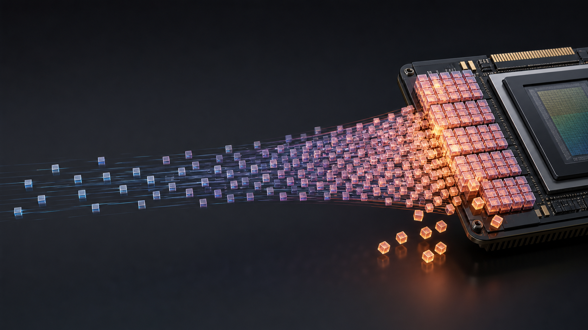
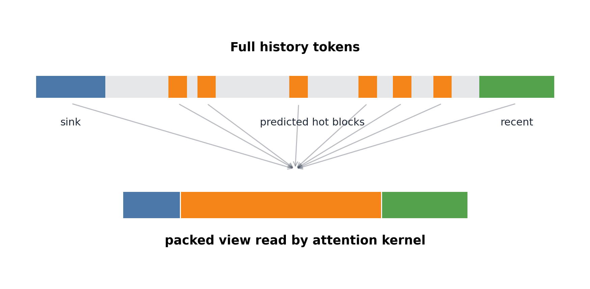
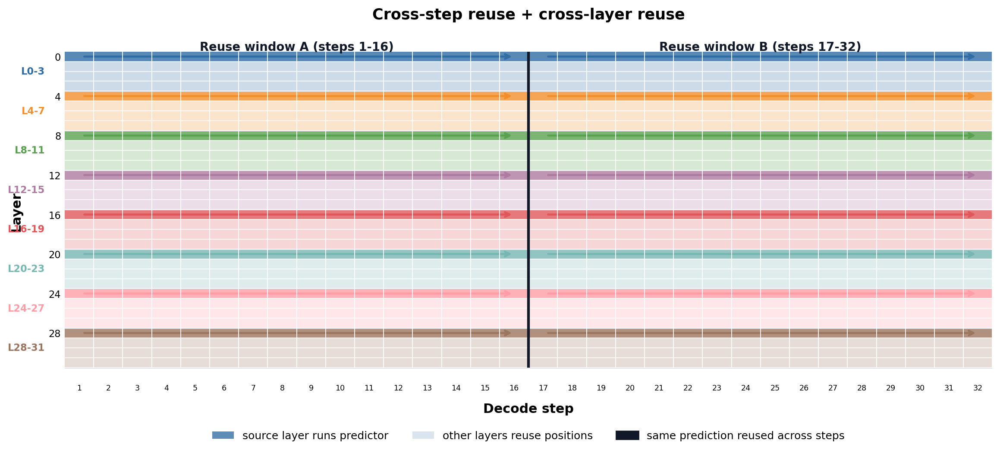
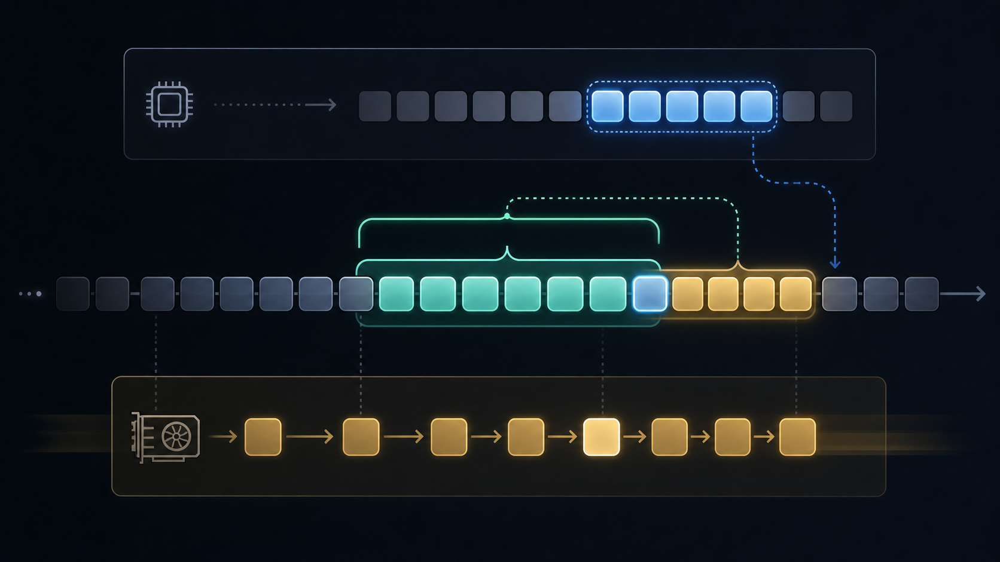
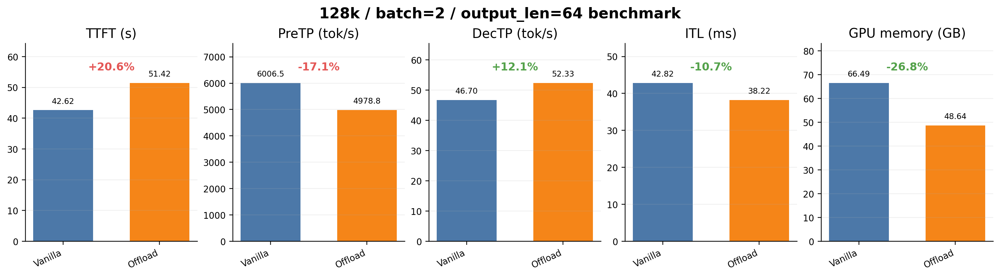
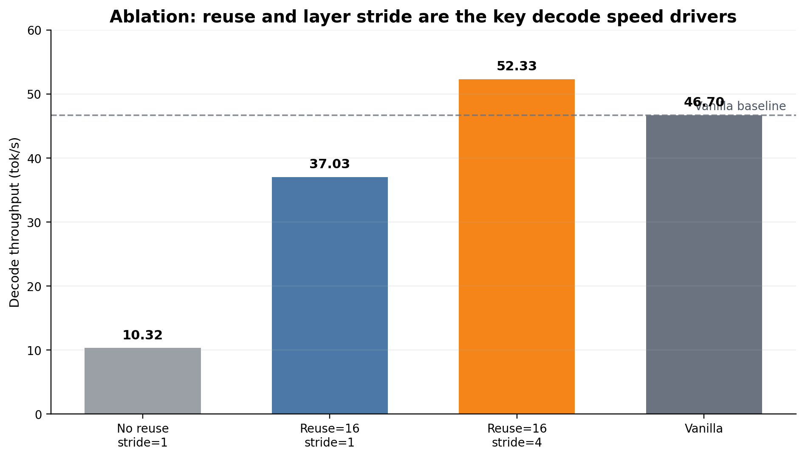
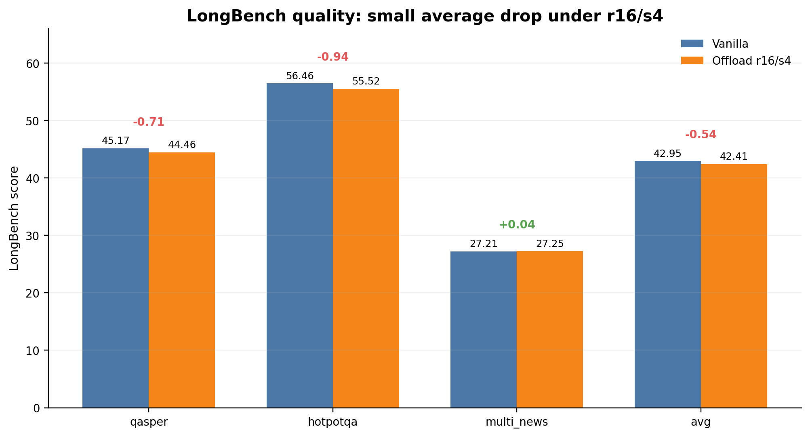

# AttnPredict-Offload 汇报 PPT 逐页内容

说明：本文档不包含标题页。建议标题页使用“AttnPredict-Offload：面向长上下文推理的 KV cache 分层卸载与预测预取优化”，副标题写“背景、原理与实验结果”。

本文档中的图片已经保存到 `attnpredict-offload资料/ppt_assets/`。其中概念图由 GPT 图像生成能力生成，图内尽量不放文字；实验图和结构示意图由本地脚本绘制，保证数值和结构可控。

---

## 第 2 页：长上下文推理的核心瓶颈是 KV cache

**建议版式**

左侧放 3 条结论，右侧放概念图。

**页面文字**

- 长上下文推理时，模型不仅要处理输入 prompt，还要在 decode 阶段反复读取历史 token 的 KV cache。
- KV cache 随上下文长度、层数、batch size 近似线性增长，长到 128K 级别后会快速吃掉 GPU 显存。
- 显存压力会进一步限制 batch size、上下文长度和并发能力，也会让 decode 阶段变慢。

**讲述要点**

KV cache（键值缓存，即 Transformer 注意力层保存历史 token 的 Key/Value 张量）是长上下文推理里最直接的显存压力来源。全注意力路径下，每一步 decode 都要面对越来越长的历史序列，既要存得下，也要读得快。

---

## 第 3 页：现有三类优化路线各有短板

**建议版式**

三列对比：KV 压缩、CPU-GPU offload、稀疏注意力。

**页面文字**

| 路线 | 做法 | 主要收益 | 主要问题 |
| --- | --- | --- | --- |
| KV 压缩 | 丢弃或合并一部分历史 KV | 降低显存 | 重要信息可能被丢掉 |
| CPU-GPU offload | 把部分 KV 放到 CPU 内存 | 扩展容量 | CPU 到 GPU 搬运可能阻塞 decode |
| Sparse Attention | 只访问部分历史 token | 降低读取和计算量 | 需要决定哪些 token 值得保留 |

**讲述要点**

offload（卸载，即把数据从 GPU 显存迁移到 CPU 内存或其他层级存储）只解决“放在哪里”，但不解决“什么时候搬”和“搬哪些”。Sparse Attention（稀疏注意力，即只让当前 token 关注部分历史 token）解决“读哪些”，但需要一个可靠的选择策略。我们的工作正是把这两件事接起来。

---

## 第 4 页：本工作的定位和贡献边界

**建议版式**

中间放一句定位，下面放三个贡献块。

**页面文字**

本工作不是重新发明 AttentionPredictor，也不是重新发明 Sparse-vLLM；本工作关注的是如何把注意力预测结果用于 KV cache 的分层管理和异步调度。

- 贡献一：用 AttentionPredictor 的热点 token 预测结果驱动 GPU active pool。
- 贡献二：在 Sparse-vLLM 的 cache manager 路径中实现 CPU full backing 与 GPU active pool 的协同。
- 贡献三：通过 reuse、layer stride、packed view 缓存和 dirty KV 延迟写回，把预测和搬运开销压到 decode 可接受范围内。

**讲述要点**

AttentionPredictor（注意力预测器，即根据历史注意力分数预测未来更可能被关注 token 的模型）给出“可能要读哪些 token”。Sparse-vLLM 提供推理引擎和 cache manager（缓存管理器，即管理 KV cache 分配、读取和更新的模块）。我们的核心工作是把二者接成一个能跑起来、能测吞吐、能做质量对比的系统路径。

---

## 第 5 页：系统总览：CPU full backing + GPU active pool

**建议版式**

全页放系统架构概念图，右侧或下方放 4 条解释。

**页面文字**

- CPU full backing 保存完整历史 KV，保证远端历史 token 不丢失。
- GPU active pool 只保留当前 decode 可能读取的 KV 子集。
- AttentionPredictor 预测 hot tokens，作为下一轮预取和驻留决策依据。
- Prefetch 和 eviction 尽量异步执行，减少对主 decode 流的阻塞。

**讲述要点**

CPU full backing（CPU 完整后备存储，即 CPU 内存中的完整 KV 副本）保证容量；GPU active pool（GPU 活跃池，即 GPU 中当前可被注意力 kernel 直接读取的 KV 槽位集合）保证速度。系统要做的是在容量和速度之间调度，而不是简单地把全部 KV 都放在 GPU 上。

---

## 第 6 页：稀疏可见集合：sink + hot + recent

**建议版式**

上方放结构示意图，下方放三类 token 解释。

**页面文字**

- Sink tokens：序列开头固定保留的一小段 token，用于保持全局锚点。
- Hot tokens：AttentionPredictor 预测出的重要历史 token，是稀疏选择的主体。
- Recent tokens：最近生成的一段 token，用于保持局部上下文连续性。
- 三类 token 合并后形成 packed view，attention kernel 只读取这份视图中的 KV。

**讲述要点**

packed view（打包读视图，即把本步注意力需要读取的 GPU slot 地址整理成紧凑表）是 Sparse-vLLM attention kernel 看到的输入。注意这里 `sink tokens` 不应翻译成“槽位 token”；它指的是序列开头固定保留的 token。`slot` 才是 GPU 中的物理槽位。

---

## 第 7 页：AttentionPredictor 如何参与推理

**建议版式**

用流程箭头展示“历史注意力分数 -> pooling -> CNN predictor -> top-k blocks -> hot tokens”。

**页面文字**

- Prefill 后，系统从最近若干 decode step 收集真实注意力分数，形成 attention history。
- 注意力分数按 block 做 pooling，降低预测器输入长度。
- CNN predictor 输出每个 block 的重要性分数。
- 系统选取 top-k block，展开为 hot token 位置，并与 sink、recent 合并。

**讲述要点**

这里的 predictor 不是直接生成文本，也不是替代主模型注意力计算。它只做一件事：预测未来几步可能需要读哪些历史区域。真正的注意力输出仍由主模型的 attention kernel 计算。

---

## 第 8 页：二维理解：跨步复用 + 跨层复用

**建议版式**

全页放二维调度图，右侧或下方放参数解释。

**页面文字**

- 横轴是 decode step，表示生成过程随时间推进。
- 纵轴是 Transformer layer，表示每一步都要经过多层注意力计算。
- 横向连续色块表示跨步复用：同一份预测结果在多个 decode step 内继续使用。
- 纵向分组表示跨层复用：每 4 层为一组，只让 source layer 运行 predictor，其余层复用 hot-token 位置。

**讲述要点**

这张图可以作为“优化一”的核心解释图。reuse 解决的是横轴问题：不要每个 decode step 都重新预测。layer stride 解决的是纵轴问题：不要每一层都单独跑 predictor。两者叠加后，predictor 调用次数从“每步每层”下降为“每 16 步、每 4 层一组”。

---

## 第 9 页：Lease 和异步预取：后台准备，前台不停

**建议版式**

左侧放调度概念图，右侧放参数解释。

**页面文字**

- `attnpredict_reuse_steps=16`：一份预测结果计划复用 16 个 decode step。
- `attnpredict_max_stale_steps=16`：后台新预测未完成时，旧 lease 最多继续使用 16 步。
- 后台预测和预取准备新 lease，主 decode 流尽量不等待。
- 这是速度和预测新鲜度之间的折中，不应表述为“无质量风险”。

**讲述要点**

lease（租约，即一段时间内 GPU active pool 应保留哪些 token 的有效状态）把逐步变化的问题变成周期性刷新。reuse 降低刷新频率，max stale 控制旧结果最多能多用多久。它们的目标是避免 predictor 和 prefetch 把 decode 主路径拖慢。

---

## 第 10 页：工程优化：把系统开销压下来

**建议版式**

三块并列：packed view 缓存、CPU backing 连续写入、dirty KV 延迟写回。

**页面文字**

- Packed view 缓存：同一 lease 内 sink 和 hot 部分稳定，缓存静态部分，每步只补 recent 部分。
- CPU backing 连续写入：prefill 阶段若 CPU slots 连续，用切片写入替代 `index_copy_` 散写。
- Dirty KV 延迟写回：decode 新生成的 KV 先留在 GPU，只有驱逐或 lease 切换时再批量写回 CPU。

**讲述要点**

dirty KV（脏 KV，即 GPU 上已有但 CPU backing 尚未同步保存的新 KV）如果每步都同步写回，会产生很多小拷贝。延迟写回的前提是不能丢数据：只要 token 要离开 GPU，就必须先写回 CPU。

---

## 第 11 页：性能实验：decode 更快，但 prefill 有代价

**建议版式**

上方放实验图，下方写实验设置和一句结论。

**实验设置**

- 模型：Llama-3.1-8B-Instruct。
- 输入长度：128k。
- `batch_size=2`，`output_len=64`。
- Baseline：vanilla Sparse-vLLM 路径，不启用 `attnpredict-offload`。
- Offload 配置：`attnpredict_reuse_steps=16`，`attnpredict_max_stale_steps=16`，`attnpredict_layer_reuse_stride=4`，默认 `sink=64`、`recent=512`、`top-k=4096`。

**页面文字**

- Decode throughput 从 46.70 tok/s 提升到 52.33 tok/s，提升约 12.1%。
- TTFT 和 prefill throughput 变差，主要来自 prefill 阶段写入 CPU backing 的额外成本。
- 显存占用在该配置下从 66.49 GB 降到 48.64 GB，但显存公平性仍需进一步用固定 GPU active pool 预算验证。

**讲述要点**

这页要诚实讲 trade-off。AttnPredict-Offload 当前最明显的收益在 decode 阶段；prefill 阶段付出了 CPU backing 写入成本。显存数字可以展示，但不要把它包装成完全公平的硬件上限结论。

---

## 第 12 页：消融实验：reuse 和 stride 是关键

**建议版式**

放消融柱状图，右侧放一句解释。

**实验设置**

- 同一模型和 128k / batch=2 / output_len=64 设置。
- 对比项包括：无跨步复用、只启用 `reuse=16`、启用 `reuse=16 + stride=4`、vanilla baseline。
- 观察指标：DecTP，decode 阶段每秒输出 token 数。

**页面文字**

- 不做复用时，predictor 相关开销过大，decode 吞吐只有约 10.32 tok/s。
- 只做跨步复用后提升到约 37.03 tok/s，但仍低于 vanilla。
- 跨步复用叠加 layer stride 后达到约 52.33 tok/s，才超过 vanilla。

**讲述要点**

这页是整个汇报的关键证据：不是 offload 一接上就快，而是必须控制 predictor 刷新频率和跨层任务数。reuse 解决“多久跑一次”，stride 解决“一次跑多少层”。

---

## 第 13 页：LongBench 质量实验：有小幅下降，不是无损

**建议版式**

放 LongBench 对比图，下方写配置。

**实验设置**

- 模型：Llama-3.1-8B-Instruct。
- 任务：qasper、hotpotqa、multi_news。
- 每个任务 200 条样本。
- `batch_size=1`，`temperature=0.0`，`top_p=1.0`，`top_k=-1`。
- Baseline：`vllm_sparse_method=""`。
- Offload：`vllm_sparse_method="attnpredict-offload"`，`reuse=16`，`max_stale=16`，`layer_reuse_stride=4`，CPU threads=8，pin staging=true。

**页面文字**

- 三任务平均分：baseline 约 42.95，offload r16/s4 约 42.41，平均下降约 0.54。
- qasper 和 hotpotqa 有小幅下降，multi_news 基本持平。
- 当前结论应表述为“质量损失较小”，不能表述为“质量无损”。

**讲述要点**

质量实验要主动承认边界。我们的目标是速度和质量都要兼顾；当前 r16/s4 的速度收益比较明确，质量下降较小，但还需要更多 LongBench 任务和更大样本验证。

---

## 第 14 页：当前结论和下一步

**建议版式**

三条结论 + 三条下一步。

**页面文字**

当前结论：

- AttnPredict-Offload 将注意力预测用于 KV cache 驻留管理，而不是只用于生成稀疏 mask。
- `reuse_steps` 和 `layer_reuse_stride` 是 decode 吞吐超过 vanilla 的关键。
- 当前配置下质量下降较小，但不是严格无损；prefill 和显存公平性仍有继续优化空间。

下一步：

- 加入更公平的 GPU active pool 显存预算控制，重新评估显存收益。
- 扩展 LongBench 任务，系统评估 reuse、stale、stride 对质量的影响。
- 探索 calibration 机制和动态 reuse，让速度与质量之间的折中更可控。

**讲述要点**

最后不要讲成“已经完全解决”。更稳妥的表达是：我们已经证明这条系统路线可行，并且找到了影响速度的关键开关；接下来要把显存对照、质量评估和校准策略补齐。

---

## 图片清单

- `ppt_assets/01_kv_cache_bottleneck.png`：长上下文 KV cache 显存瓶颈概念图。
- `ppt_assets/02_hierarchical_cache_architecture.png`：CPU full backing + GPU active pool 系统架构概念图。
- `ppt_assets/03_lease_reuse_prefetch.png`：lease 复用、stale 容忍和异步预取概念图。
- `ppt_assets/04_benchmark_summary.png`：128k / batch=2 / output_len=64 性能和显存对比图。
- `ppt_assets/05_ablation_decode_throughput.png`：reuse 与 layer stride 消融图。
- `ppt_assets/06_longbench_quality.png`：LongBench 三任务质量对比图。
- `ppt_assets/07_visible_set_packed_view.png`：sink/hot/recent 到 packed view 的结构示意图。
- `ppt_assets/08_layer_stride_reuse.png`：layer stride=4 跨层复用示意图。
- `ppt_assets/09_cross_step_layer_reuse_2d_v3.png`：跨步复用和跨层复用二维合并示意图。
