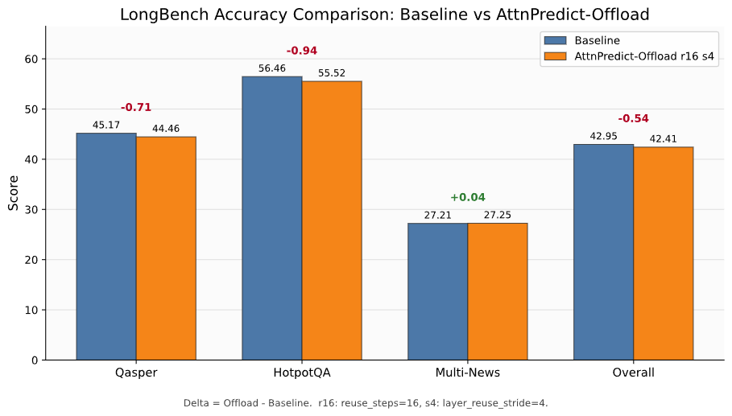

# AttnPredict-Offload 背景原理文档审查与 PPT 大纲

## 一、总体判断

`AttnPredict_Offload_背景与原理解释.docx` 的主线是成立的：它按“长上下文 KV cache 瓶颈、AttentionPredictor 预测热点 token、CPU-GPU 分层存储、lease 复用、异步预取、实验结果”的顺序展开，适合作为汇报 PPT 的内容来源。

但是，文档不能原样上台讲。当前版本有几处说法偏满，尤其是“保证生成质量”“从根本上降低显存占用”“显存降低 26.8%”这类表述，和目前实现及实验边界不完全一致。建议在 PPT 中改成“质量风险可控”“在特定配置和测试条件下观察到显存占用降低”“当前 offload 版本的显存公平性仍需进一步隔离验证”。

## 二、必须修改的问题

1. “从根本上降低显存占用”不够严谨。

   当前实现确实把完整历史 KV cache 放到 CPU backing，并让注意力 kernel 主要读取 GPU active pool。但工程上 GPU active pool 仍受 `gpu_memory_utilization` 等参数影响，未必严格等于 `top-k + sink + recent` 的最小预算。因此 PPT 中不要说“从根本上降低”，建议改为“通过 CPU full backing 与 GPU active pool 分层管理，降低完整 KV 长期驻留 GPU 的需求”。

2. “在保证生成质量的前提下”过强。

   LongBench 完整小实验显示：baseline 三任务平均约 42.95，AttnPredict-Offload r16/s4 平均约 42.41，差值约 -0.54；其中 qasper、hotpotqa 有小幅下降，multi_news 基本持平。应改为“在尽量控制质量下降的前提下提升 decode 吞吐”，或“质量损失在当前三任务实验中较小，但仍需更多任务验证”。

3. “LongBench 小样本 reuse=4/12/16 输出完全一致，未观察到质量退化”不能作为最终质量结论。

   这只能说明 reuse 参数在那组样本上未造成可见差异，不能推出 offload 相比 vanilla 没有质量损失。PPT 应使用最新三任务结果：qasper、hotpotqa、multi_news 上 r16/s4 的平均分比 baseline 低约 0.54。

4. `sink tokens` 翻译为“槽位 token”是错的。

   `sink tokens` 应写作“起始保留 token”或“注意力汇聚 token”。它指序列开头固定保留的一段 token，不是 GPU slot。`slot` 才是“槽位”。

5. “计算量从 OL 降至 ...”有符号错误。

   应改为“单步注意力读取长度从完整历史长度 `O(L)` 降为 `O(sink + top-k + recent)`”。如果上 PPT，建议不用公式堆叠，直接写“从读全量历史 KV，变成只读起始保留、预测热点和近期窗口三部分 KV”。

6. “Active pool 的大小由 token 预算决定，远低于完整序列长度”需要加边界。

   这是目标设计语义，但当前实现的显存分配还受到 GPU slot 预分配策略影响。建议改成“逻辑可见集合由 token 预算决定；工程实现中，GPU active pool 的实际显存占用还与 slot 预分配策略有关”。

7. “跨层 attention 模式相似，所以可以复用”需要弱化。

   可以说“在 top-k 预算较大时，跨层 hot token 集合存在可利用的重叠，因此可尝试按 stride 复用”。不要说成严格规律。跨层复用是速度-质量折中，不是理论必然。

8. “packed view 优化和 dirty KV 延迟写回将 52.33 tok/s 推向极限”不建议使用。

   “极限”太满。建议改为“进一步减少固定开销，使最终结果稳定在约 52 tok/s 水平”。

9. 实验中的显存收益要单独加注释。

   文档写 vanilla 66.49 GB、offload 48.64 GB，下降 26.8%。这个数可以展示，但必须标明“该结果来自当前 128k / batch=2 / output_len=64 配置，不等价于完全公平的显存上限对比；后续需要固定 GPU slot 预算或加入 `attnpredict_offload_gpu_slots` 之类参数做更公平对照”。

10. 类比可以保留在口头解释，不建议放太多在正式 PPT 正文。

    “智能书架 + 地下书库”的类比适合讲给听众建立直觉，但每页 PPT 主体最好还是放真实机制图：CPU full backing、GPU active pool、predictor、prefetch queue、packed view、attention kernel。

## 三、适合 PPT 的三段式结构

### 第一部分：背景

建议 3 页。

1. 长上下文推理为什么难

   讲清楚 KV cache（键值缓存，保存历史 token 的 Key/Value 张量供后续注意力读取）会随上下文长度线性增长。128K 上下文下，KV cache 会成为显存和吞吐的主要瓶颈。

2. 现有路线和缺口

   对比三条路线：KV 压缩、CPU-GPU offload（卸载，把部分 KV 从 GPU 移到 CPU 存放）、Sparse Attention（稀疏注意力，只访问部分历史 token）。重点说单独 offload 会被 CPU-GPU 搬运拖慢，单独稀疏又要解决“该保留哪些 token”的问题。

3. 我们的定位

   不声称发明 AttentionPredictor，也不声称发明 Sparse-vLLM。贡献是把 AttentionPredictor（注意力预测器，根据历史注意力分数预测未来更可能被访问的 token）接入 Sparse-vLLM 的 cache manager 路径，形成“预测热点 token + CPU/GPU 分层缓存 + 异步预取 + 复用调度”的系统方案。

### 第二部分：原理

建议 5 页。

4. 总体架构图

   图里放：主模型 decode、AttentionPredictor、CPU full backing、GPU active pool、prefetch queue、packed view、attention kernel。用一条主线说明：完整 KV 放 CPU，GPU 保留当前要读的 KV，预测器提前决定下一批 hot tokens。

5. 稀疏可见集合

   展示三部分：sink tokens、hot tokens、recent tokens。把 `sink tokens` 写成“起始保留 token”，不要写“槽位 token”。强调 attention kernel 只读 packed view 指定的 KV。

6. lease 和 reuse

   讲 `reuse_steps`：一份预测结果复用多少步。讲 `max_stale_steps`：后台新预测没准备好时，旧 lease 最多还能继续用多久。这里要承认它是速度-质量折中，不能说完全无风险。

7. layer stride 跨层复用

   讲 `layer_reuse_stride=4`：每 4 层只让组首层跑 predictor，其余层复用 hot token 位置。强调“位置复用，KV 物理存储不共享”。

8. 工程优化

   合并讲 packed view 静态缓存、CPU backing 连续写入、dirty KV 延迟写回。每个只讲一句目的：减少每步 view 构造、减少 prefill 写入开销、减少 decode 高频小拷贝。

### 第三部分：实验结果

建议 4 页。

9. 速度和显存结果

   展示 128k / batch=2 / output_len=64：vanilla DecTP 46.70 tok/s，offload DecTP 52.33 tok/s，提升约 12.1%；TTFT 和 PreTP 下降，需要诚实展示。显存 66.49 GB 到 48.64 GB 可展示，但加注“当前测试配置下观测值，显存公平性仍需进一步控制 GPU active pool 预算验证”。

10. 消融结果

    展示无复用约 10.32 tok/s，只做跨步复用约 37.03 tok/s，跨步 + 跨层复用约 52.33 tok/s。结论：真正让 decode 超过 vanilla 的是 reuse 与 stride 的组合。

11. LongBench 质量结果

    展示最新三任务图：baseline 平均约 42.95，offload r16/s4 平均约 42.41，平均下降约 0.54。qasper、hotpotqa 小幅下降，multi_news 基本持平。结论写“质量损失较小但不是零，需要继续扩展任务验证”。

12. 总结和下一步

    总结三句话：一是预测器决定读哪些历史 token；二是 offload 负责把完整 KV 放到 CPU 并按需预取；三是 reuse/stride 把预测器开销降下来。下一步：公平显存对照、更多 LongBench 任务、校准机制与动态 reuse 策略。

## 四、一小时制作节奏

前 10 分钟：确定 12 页标题和每页一句主结论。

第 10-30 分钟：完成背景与原理 8 页，先用简洁流程图占位，不追求复杂美术效果。

第 30-45 分钟：补实验结果 3 页，直接使用已有 LongBench 对比图和吞吐/显存表。

第 45-55 分钟：统一术语，把“保证质量”“根本降低”“无退化”等过强表达全部改掉。

最后 5 分钟：按 12 页顺一遍，每页只保留一个主信息点。
