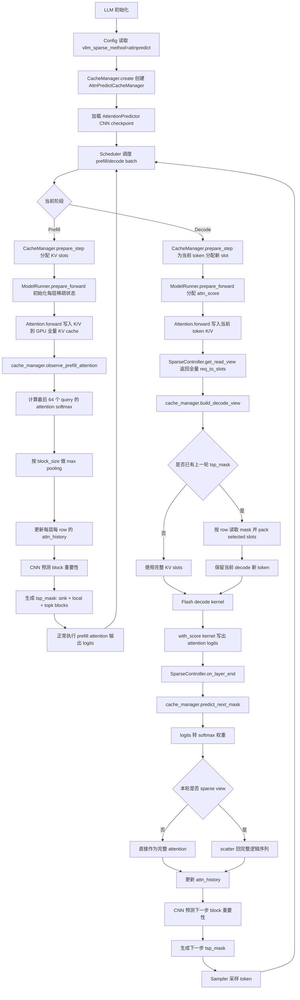

# AttentionPredictor 集成修复说明与推理流程

本文档记录 Codex review 后对 AttentionPredictor 集成的修正点、代码位置，以及集成后的 Sparse-vLLM 推理流程。

## 一、修改目标

Claude Code 初版集成已经把 `attnpredict` 注册进 Sparse-vLLM，但存在若干运行时错误：

- `attn_history` 维度与原始 AttentionPredictor 不一致。
- mask 按 batch 下标保存，连续 batching 时可能串序列。
- decode sparse view 后没有把稀疏 attention 恢复到完整逻辑序列。
- CNN 输入 dtype 与模型权重 dtype 可能不一致。
- prefill 阶段没有按原始实现用最后 64 个 query 初始化 attention history。
- Llama 3.1 的 `rope_scaling` 仍会触发断言失败。

本次修复遵循 repo-local `$add-sparse-method` 约束：方法状态保存在 cache manager 内，`attention.py` 只调用通用 hook，不放 AttentionPredictor 专属分支。

## 二、代码修改位置

### 1. `src/sparsevllm/engine/cache_manager/attnpredict.py`

这是本次修复的核心文件。

主要改动：

- 将 `attn_history` 从“每层一个 tensor”改为“每层、每 cache row 一个 tensor”：
  - 当前结构：`list[dict[int, torch.Tensor]]`
  - row id 来自 `req_indices`
  - 避免连续 batching 下 batch 位置变化造成 mask/history 串序列
- 将历史形状修正为原始 AttentionPredictor 语义：
  - `attn_history[row]`: `(num_heads, history_steps=64, pooled_len)`
  - 单步 decode attention 会作为 `(num_heads, 1, full_seq_len)` 追加
- 新增 `observe_prefill_attention(...)`：
  - prefill 阶段计算最后 `history_steps` 个 query 对完整 KV 的 attention
  - 与原始实现中 `query_states[:, :, -self.history_step:, :]` 的逻辑一致
  - 用于让首个 decode step 前已有 CNN 预测 mask
- 重写 `build_decode_view(...)`：
  - 根据上一轮预测 mask 构造 packed slots
  - 使用 `active_slots[row_idx, positions]`，不再误用 batch 下标
  - 始终保留当前 decode 新 token，对齐原始实现中把 newest KV 拼回 sparse KV 的行为
- 重写 `predict_next_mask(...)`：
  - 接收 decode kernel 写出的 attention logits
  - 转成 softmax 权重
  - decode `with_score` kernel 写入的是未乘 `sm_scale`、未 softmax 的 raw logits，因此这里执行 `softmax(logits * attn_scale)` 不是二次 softmax
  - 如果本轮使用了 packed sparse view，则按逻辑位置 scatter 回完整序列，相当于原始 `expand_attn()`
  - 更新 history 并预测下一步 mask
- `_create_tsp_mask(...)` 当前生成整层共享的 token keep mask：
  - 原始实现是 per-head mask
  - Sparse-vLLM 当前 decode view/kernel 接口按 batch row 选择 slots，还没有 head 维 active slots，因此 v1 用 head 维 max-pooling 合并为 shared mask
  - 这是精度取舍，不是运行错误
- CNN 固定转为 `float16`，与原始实现一致。
- `free_seq(...)` 中只清理对应 cache row 的 `attn_history` 和 `tsp_mask`，不再全局清空该层 `_last_decode_view`。

### 2. `src/sparsevllm/engine/cache_manager/base.py`

新增通用 hook：

```python
def observe_prefill_attention(...):
    return None
```

用途：

- 让 `attention.py` 在 prefill 时可以调用一个通用接口。
- 默认实现为空，其他 sparse method 不受影响。
- `AttnPredictCacheManager` 覆写该 hook。

### 3. `src/sparsevllm/layers/attention.py`

在 prefill 分支、调用 `context_attention_fwd(...)` 之前，新增：

```python
cache_manager.observe_prefill_attention(...)
```

注意：

- 这里没有写 `if method == "attnpredict"`。
- `attention.py` 仍保持方法无关。
- decode 阶段继续通过已有 `cache_manager.build_decode_view(...)` 生效。

### 4. `src/sparsevllm/engine/sparse_controller.py`

修改 `attnpredict` 的 `on_layer_end(...)`：

- 之前会提前对 head 做 `max(dim=1)`。
- 现在直接把完整 `state.attn_score` 交给 cache manager。

原因：

- 原始 AttentionPredictor 是按 head 预测，然后在 mask 创建时聚合。
- 如果过早 head max-pooling，会丢失 CNN 输入的 head 维度。

同时更新 `_needs_attn_score(...)` 注释：

- decode 阶段收集的是 attention logits。
- cache manager 内部再转 softmax 权重，与原始实现对齐。

### 5. `src/sparsevllm/config.py`

新增 `attnpredict` 配置校验：

- `attnpredict_model_path` 必填。
- checkpoint 路径必须存在。
- `attnpredict_history_steps`、`attnpredict_pooling_block_size` 必须大于 0。
- AttentionPredictor 复用通用稀疏预算：`num_top_tokens` 必须大于 0，`num_sink_tokens` / `num_recent_tokens` 不能小于 0。

这样可以避免没有 checkpoint 时静默使用随机 CNN。

### 6. `src/sparsevllm/layers/rotary_embedding.py`

补充 Llama 3.1 所需的 RoPE scaling 支持：

- 支持 `rope_scaling["rope_type"] == "llama3"`。
- 支持 `linear` scaling。
- 用 `_ROPE_CACHE` 替代原来的单项 `lru_cache`，避免不同 rope config 复用同一个 RoPE。

这个改动不是 AttentionPredictor 本体，但集成示例使用 Llama 3.1；不修会在模型初始化阶段失败。

### 7. `README.md`

补充 `attnpredict` 到支持方法列表，并增加参数说明：

- `attnpredict_model_path`
- `attnpredict_history_steps`
- `attnpredict_pooling_block_size`
- `num_top_tokens`
- `num_sink_tokens`
- `num_recent_tokens`

### 8. `docs/attnpredict_integration_changes.md`

补充 Codex review 后修正摘要，并明确说明：

- 当前实现的是跨步预测 mask。
- 当前没有实现原始 `OffloadedCache` 的 CPU 到 GPU 异步 KV 预取。

## 三、集成后的推理流程图



## 四、关键时序说明

### Prefill

prefill 仍执行完整 attention。额外增加的工作是：

1. 对每个层、每个序列，取最后 `attnpredict_history_steps` 个 query。
2. 用当前层已经写入 GPU 的 full KV cache 计算 attention。
3. 更新 `attn_history`。
4. CNN 预测出首个 decode step 可用的 `tsp_mask`。

### Decode

decode 使用一拍延迟的预测：

1. step `t` 开始时，`build_decode_view()` 使用 step `t-1` 预测出的 mask。
2. decode kernel 只看 selected slots，但当前新 token 会强制保留。
3. kernel 写出 selected view 上的 attention logits。
4. `predict_next_mask()` 将 logits 转 softmax。
5. 如果使用了 sparse view，则 scatter 回完整逻辑 token 空间。
6. CNN 预测 step `t+1` 的 mask。

## 五、跨步预取状态

当前实现了跨步预测，但没有实现原始论文代码中的 CPU-GPU 异步 KV 预取。

已实现：

- step `t` 预测 step `t+1` 的 sparse mask。
- step `t+1` 的 `build_decode_view()` 按 mask 选择 KV slots。

未实现：

- `ThreadPoolExecutor`
- `prefetch_stream`
- `key_buffer` / `value_buffer`
- CPU cache 中按 mask gather KV，再异步搬回 GPU
- 原始 `OffloadedCache.get_kv(...)` 对应的 CPU→GPU 预取路径

原因：

- Sparse-vLLM 当前 `attnpredict` 版本继承 `StandardCacheManager`。
- 全量 KV 仍常驻 GPU。
- 当前稀疏效果来自逻辑 read view，而不是物理 offload/prefetch。

## 六、与原始实现的边界

当前集成严格保留 AttentionPredictor 的核心预测时序：用 step `t` 的 attention history 预测 step `t+1` 的 KV 选择。但有两处需要明确：

1. decode `attn_score` 语义：Sparse-vLLM 的 `gqa_flash_decode_stage1_with_score` / `flash_decode_stage1_with_score` 在 `att_value *= sm_scale` 之前写出分数，所以 cache manager 里要按原始 attention 公式做 `softmax(logits * attn_scale)`。
2. mask 粒度：原始 `OffloadedCache` 使用 per-head mask 并据此 gather KV；当前 Sparse-vLLM v1 使用 shared token mask，因为现有 packed slots 是按 batch row 传给 decode kernel 的，没有 head-specific slots 入口。

## 七、验证

已完成语法级验证：

```bash
python -m py_compile \
  src/sparsevllm/config.py \
  src/sparsevllm/engine/cache_manager/base.py \
  src/sparsevllm/engine/cache_manager/__init__.py \
  src/sparsevllm/engine/cache_manager/attnpredict.py \
  src/sparsevllm/engine/cache_manager/attnpredict_cnn.py \
  src/sparsevllm/engine/sparse_controller.py \
  src/sparsevllm/layers/attention.py \
  src/sparsevllm/layers/rotary_embedding.py \
  src/sparsevllm/models/llama.py
```

端到端验证仍需要实际模型权重和 AttentionPredictor CNN checkpoint。
