## **《DeltaKV: Residual-Based KV Cache Compression via Long-Range Similarity》**

### 1、研究背景与动机 

*   **研究背景：**
    在长上下文大语言模型（LLM）的部署中（如智能体、长文档分析、复杂推理等），**KV Cache内存的线性增长**成为了核心瓶颈。
    
    > 例如，Llama-3.1-8B在128k上下文、Batch Size=8时，KV Cache需要超过130GB的内存，远超单张GPU的容量。
    
*   **现有方法的局限性：**
    
    *   **Token 选择**
    
        *   **静态驱逐（如SnapKV，H2O）**：基于启发式规则或早期的注意力信号**永久性地移除Token**，在多轮对话或复杂推理中容易丢失后续需要的关键信息。
    
        *   **动态选择（如OmniKV、Quest、PQCache等)**: 解码期间自适应地选择Token。虽然能够实现近乎无损精度，但它们依然在显存中**保留了完整的KV缓存**，并依赖于显存卸载（Offloading），性能受限于PCIe带宽。
    
            > DeltaKV方法中的KVcache**常驻GPU**，无需 数据卸载 即可直接缩减KV缓存的内存占用。
    
    *   **KV缓存压缩**
    
        *   利用低秩（low-rank）或子空间结构来减少内存占用，局限在推理时需要**将整个压缩后的KV缓存解压/重建**后才能进行注意力计算，从而引入巨大的额外计算开销。
    
            > DeltaKV仅压缩相对于检索到的历史参考Token的Token级残差，并且在结合稀疏注意力时，仅按需重建  小于10% 的Token，从而实现了显著提升的效率。
    
    *   **KV缓存量化**
    
        *   通过**降低KV缓存中数值的存储和计算精度**（如KIVI）来减少内存占用和数据传输带宽。局限在于它**无法减少注意力机制的计算量**，且由于采用通道级操作，极难与稀疏化技术有效结合。
    
            > DeltaKV生成的是低幅度的残差，这些残差天然支持Token级别的量化，能够进一步降低内存占用
    
    *   **Token聚类**
    
        *   通过重用 共享的表示 来压缩KV缓存，但现有的方法要么依赖 基于CPU的数据结构 从而引发PCIe传输瓶颈（例如**ClusterKV**），要么只关注 局部相似性 从而限制了重建质量（例如**Chelsea**）
    
            > DeltaKV利用 长距离相似性 执行全局的、常驻GPU的残差压缩，完全避免了外部内存传输。
    
    *   **推理框架**
    
        *   流行的推理框架（如vLLM、SGLang和LightLLM）均针对全注意力和基于页面的KV管理（page-based KV management）进行了高度优化，这**使得稀疏化和压缩技术很难被整合进去**。最近的一些适配方案要么牺牲了批处理可扩展性，要么依赖于优化程度较低的底层后端。
    
            > 论文提出的 **Sparse-vLLM** 摒弃了 基于页面的假设，**原生支持稀疏和不规则的KV布局**，使得在实践中高效部署DeltaKV成为可能。
    
* **核心动机（两大经验性发现）：**

  作者对KV Cache的特征进行了实证分析，发现了两个关键现象：

  > 图2观察 实验设置如下：
  >
    > 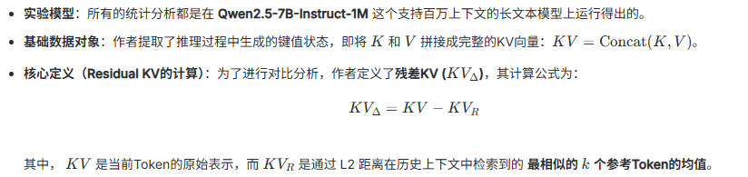
  >
  > *K、V实验者隐藏维度拼接，形成一个维度为2d_k的联合向量*
  
  1. **长距离Token间相似性**：语义相似的Token通常**全局分布在整个上下文**中，而不是仅仅局限在邻近位置（超60%的相似Token相距16个位置以上）。
  
     > 普遍存在的长距离相似性表明，有效的KV缓存压缩**必须依赖于全局检索**，而不是基于局部的启发式规则。
     >
     > - 如图2a所示，KV表示与历史Token的余弦相似度超过0.9的概率极大。
     > - 图2b显示**超过60%的最相似Token出现在距离当前位置16个距离以上的地方**。
  
  2. **高度共享的潜在成分**：不同Token的KV表示中**存在大量共享的高范数特征**。如果将这些共享特征减去，剩下的“残差”信号幅度极低，非常容易被压缩。
  
    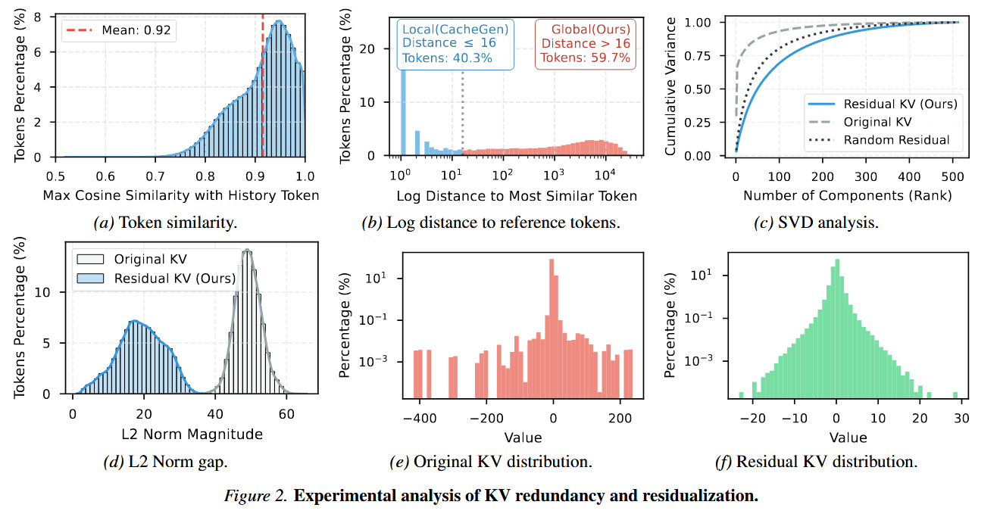
  
     > - **(a) Token similarity（Token间的相似度）**
     >   *   **计算方法**：在模型处理长文本时，对于序列中的每一个Token的 $KV$ 向量，系统遍历其之前出现过的所有历史Token，计算它们之间的 **余弦相似度**。
     >   *   **指标得出**：记录每个Token与历史Token相似度中的**最大值**。图 (a) 就是这些“最大余弦相似度”在整个测试集中的频率分布直方图。
     >   *   **证明：**说明绝大多数Token在历史上下文中都能找到一个极度相似的参考对象（平均相似度高达0.92），证明KV缓存中存在极高的信息冗余。
     > - **(b) Log distance to reference tokens（与最相似参考Token的距离）**
     >   *   **计算方法**：基于图(a)的结果，找到与当前Token最相似（余弦相似度最高）的那一个历史Token。
     >   *   **指标得出**：计算这两个Token在序列中的**位置跨度（距离）**。例如，当前是第1000个Token，最相似的是第800个，距离就是200。作者将这些距离取对数（例如想就1000，在横坐标走上的值就是3）后画出分布图，并统计了距离 $\le 16$（局部）和 $>16$（全局）的比例（分别是40.3%和59.7%）。
     >   *   **证明：**说明近60%的最相似Token分布在距离当前位置非常遥远的历史中，证明寻找最佳参考必须依赖全局检索而非局部窗口。
     >
     > - **(c) SVD analysis（SVD奇异值分解与频谱分析）**
     >   *   **计算方法**：作者对“原始KV矩阵”和“残差KV矩阵”分别进行了数学上的 **奇异值分解（SVD）**。SVD可以提取出矩阵中的主成分（主要特征方向）。
     >   *   **指标得出**：计算前 $N$ 个主成分的特征值之和占总体特征值总和的比例，即**累积方差（Cumulative Variance）**。原KV曲线快速升到1.0说明冗余大（少数特征占主导），残差KV曲线缓慢上升说明特征被“打平”了，变成了像随机噪声一样的独立信息。
     >   *   **证明：**说明原始KV高度共享少数公共特征模板（冗余大），而减去参考值后的残差KV成功剔除了这些公共模板，变成了没有冗余套路的独立信号。
     >
     > - **(d) L2 Norm gap（L2范数的对比）**
     >   *   **计算方法**：对每一个Token的“原始 $KV$ 向量”和“残差 $KV_\Delta$ 向量”，计算它们的 **L2范数（欧几里得长度，即向量各元素平方和的平方根）**：$\|KV\|_2$ 和 $\|KV_\Delta\|_2$。
     >   *   **指标得出**：统计这些范数值的分布并绘制双峰直方图。量化了减去相似参考值后，残差信号“能量/幅度”的剧烈衰减。
     >   *   **证明：**说明减去相似的历史参考特征后，残差KV的总体数值幅度（能量）发生了剧烈衰减，数据“体积”变得非常小。
     >
     > - **(e) Original KV distribution（原始KV的数值分布）**
     >   *   **计算方法**：直接将网络层中提取出的原始 $KV$ 张量展平，提取出每一个具体的浮点数值。
     >   *   **指标得出**：对这些庞大数量的浮点数进行区间分桶，以对数坐标统计各个数值区间出现的百分比。图(e)揭示了原始张量**数值范围广且极值多**的天然属性。
     >   *   **证明：**说明原始KV的具体数值跨度极其狂野且存在严重的极端离群值，直接对其进行压缩容易导致严重的精度损失。
     >
     > - **(f) Residual KV distribution（残差KV的数值分布）**
     >   *   **计算方法**：与(e)同理，只不过这次展平并统计的是通过公式 $KV_\Delta = KV - KV_R$ 计算出来的残差张量。
     >   *   **指标得出**：统计残差中的具体浮点数值分布。结果显示数值范围被强烈压缩到了0附近。
     >   *   **证明：**说明残差KV的具体数值呈现完美的正态分布且高度集中在0附近，这种消除了极端值的“乖巧”数据极其适合被模型高效压缩或量化。

### 2、方法与创新

本篇论文的创新分为**算法层**和**系统层**两部分：

*   **算法创新：DeltaKV 压缩框架**
    DeltaKV不是直接压缩原始KV，而是压缩“残差”。
    
    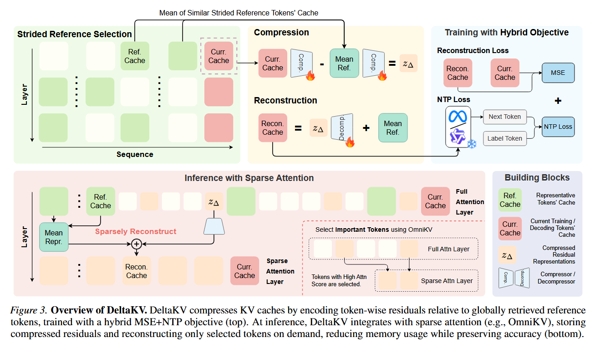
    
    > DeltaKV 论文的**核心架构全景图**: 上半部分展示了核心的 压缩/重建机制 与 训练过程，下半部分展示了在实际推理部署中如何结合 稀疏注意力 来节省显存和算力。
    >
    > - **压缩/重建机制 与 训练过程**
    >
    >   - 压缩/重建机制：
    >
    >     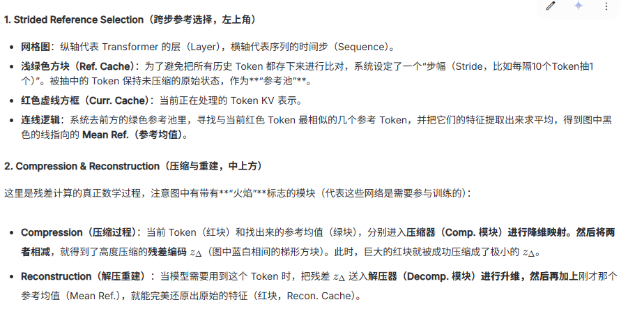
    >
    >   - **训练过程**
    >
    >     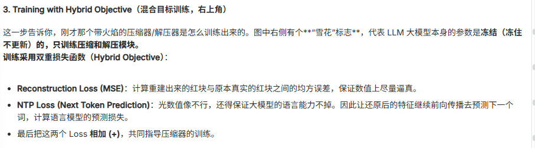
    >
    > - 推理部署阶段
    >   - 既然最终都要解压还原，那怎么能省内存和算力呢？答案是**和 OmniKV 这种稀疏注意力机制结合，实现“按需解压”**
    >   - 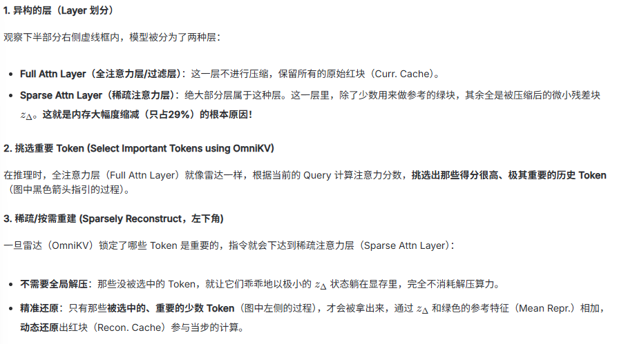
    
    1. **步幅参考选择：** 为了避免全局检索开销太大，以固定步幅（如 $s=10$）抽取历史Token构成参考集。
    
    > 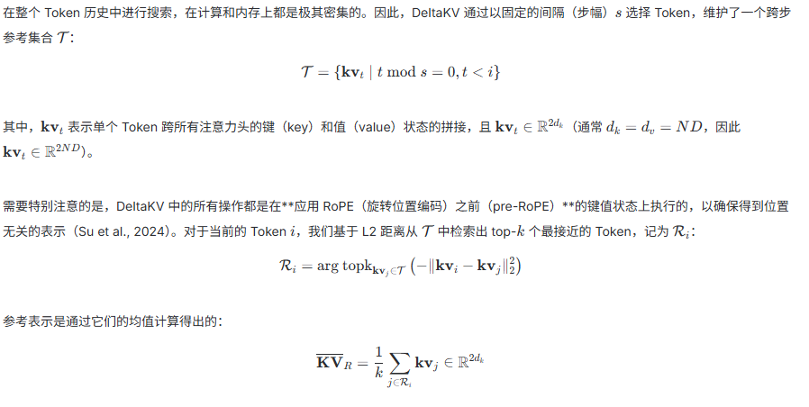
       >
       > $R_i$保留了第i个token在该层与前面最相似的那些token索引
       >
       > 欧氏距离前面带个符号是为了让topk（默认选最大）选取距离最小的那些kv对应的索引（距离越小越相似）。
    
    2. **残差计算与压缩：** 对于当前Token，从参考集中找出L2距离最近的 Top-$k$ 个Token并求均值得到$KV_{mean}$。当前KV和参考均值使用 MLP 压缩后想减，便可以得到残差向量。
    
       > 压缩器：
       >
    > 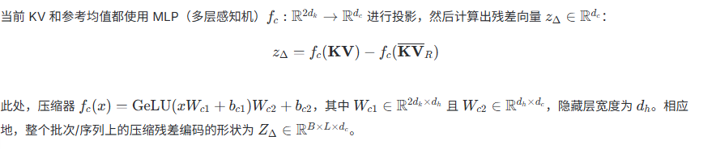
    
    3. **按需解压与稀疏注意力结合：** 结合OmniKV等稀疏注意力机制，在推理时，只有被选为“重要”的Token，才会通过解压器还原，并加上参考均值重建KV。
    
       > 重建：
       >
    > 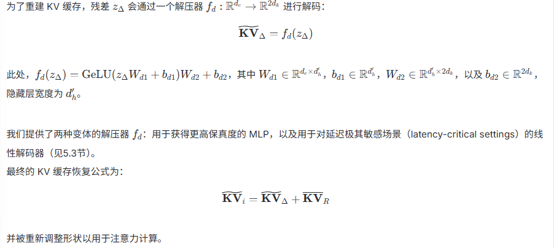
    
    4. **混合训练目标：** 冻结LLM参数，仅用极少算力（单卡8小时）训练压缩/解压模块。Loss函数结合了 **MSE（重构误差） + NTP（Next-Token预测误差）**，确保既能还原数值，又能保住生成能力。
    
       > **训练过程详见附录A**
    
*   **系统创新：Sparse-vLLM 推理引擎**
    为了让压缩真正转化为加速，作者开发了Sparse-vLLM：
    
    >  **Sparse-vLLM**
    >
    > -  一个为稀疏和压缩 KV 布局优化的模块化推理框架 , 与当前耦合 内存管理 和 模型执行 的框架（vllm、sglang）不同，Sparse-vLLM 干净利落地将这些关注点进行了解耦。
    >
    > - 核心设计：引入了一个可插拔的 CacheManager（缓存管理器）以支持多样化的存储结构，并引入了一个 Sparse Controller（稀疏控制器）来统一管理稀疏视图的构建和 KV 的生命周期。实现细节详见**附录 B**。
    
    *   **解耦的内存管理 (Modular CacheManager)：** 摒弃了传统的Page机制，原生支持稀疏和不规则的KV内存布局（将全精度参考Token和压缩后的残差Token分池管理）。
    
        > 稀疏注意力算法在如何分配、更新和回收 KV 缓存上存在巨大差异。
        >
        > Sparse-vLLM 通过模块化的 CacheManager 抽象解决了这种异构性，该抽象封装了**物理内存的分配以及逻辑-物理映射**，从而能够灵活地整合多样化的稀疏化和压缩策略。
    
    *   **稀疏控制器（Sparse Controller）**:将稀疏算法与模型架构解耦,负责在模型的前向传递中的稀疏推理。
    
        > 包含两个阶段：
        >
        > 1. **前向传递前（构建视图）**：在进入注意力算子之前，控制器基于当前配置的算法计算出逻辑视图；
        > 2. **前向传递后（生命周期管理 ）**：在计算完成之后，控制器负责触发 KV 缓存的更新逻辑。
    
    *   **高效算子 (Kernel Optimizations)：** 引入Triton优化的Token级注意力算子，支持非连续内存的间接寻址，避免了昂贵的内存碎片整理。
    
        > 在算子层面上，Sparse-vLLM **复用**了开源生态系统中高性能的 Triton 算子，并引入了专门为 DeltaKV 定制的优化内核。
        >
        > 注意：来自 LightLLM 的 Token 级 Triton 注意力算子能够高效地在非连续内存上运行，契合了 CacheManager 的离散存储布局，从而消除了昂贵的内存碎片整理开销。
        >
        > 作者进一步将注意力分数的提取融合到 Triton 内核中，避免了冗余的 PyTorch 级别计算，并提高了吞吐量。

### 3、实验设计与结果分析

*   **实验设置：**

    - **模型**： Llama3.1-8B-Instruct、Qwen2.5-7B-Instruct-1M、Qwen2.5-32B-Instruct 以及 DeepSeek-R1-Distill-Qwen-7B。

    - **baselines**:  

      - **静态驱逐方法：** 包括 **SnapKV**、**PyramidKV** 和 **AdaKV**。这些方法永久移除被判定为不重要的 Token，这在多轮对话或复杂推理场景中可能会丢失关键信息。
      - **动态稀疏方法：** 包括 **Quest** 和 **OmniKV**。它们在计算期间为了稀疏注意力而自适应地选择 Token，但在 GPU/主机内存中保留了完整的 KV Cache。
      - **KV Cache压缩：** **Palu** , 只考虑单个 Token 的信息，忽略了 Token 之间的相似性。

    - **Evaluation**

      - **LongBench**（通用长上下文理解）、**SCBench**（多轮对话）以及 **AIME**（复杂推理）

      - 为了量化在内存和计算方面的效率收益，论文报告了 **KV Cache Keep Ratio (KR，KV Cache保留率)** 和 **KV Cache Compute Ratio (CR，KV Cache计算率)**。

        > 数据集详细信息和指标定义在附录 **D.1** 中提供

*   **下游任务性能：**

    1. **Longbench任务**

    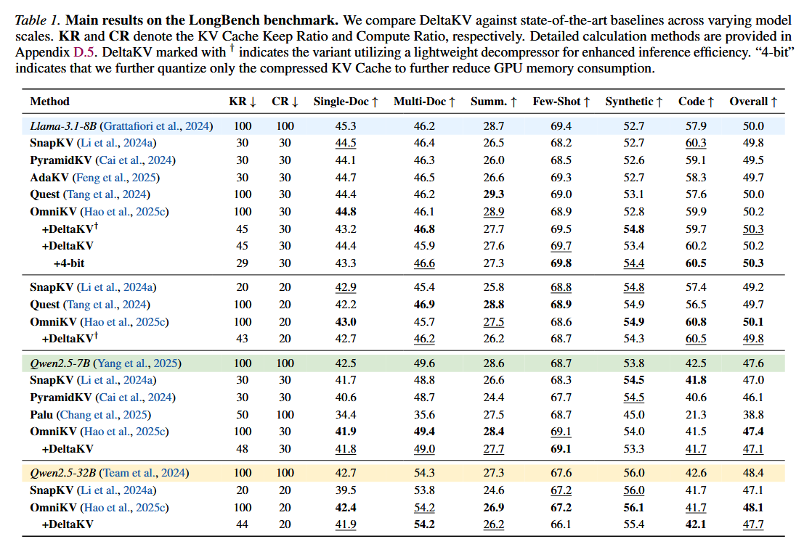

    > *表 1 展示了各方法在 LongBench 上的表现。表格列包含了 KR(越低越好)、CR(越低越好)、以及单文档QA、多文档QA、摘要、Few-Shot、合成任务、代码生成的分数及其总体平均分(Overall，越高越好)。DeltaKV 在 KR 为 45% (甚至量化后达到 29%) 时，总体平均分依然逼近或持平满血的 Full Cache。*

    2. **多轮SCBench任务**

    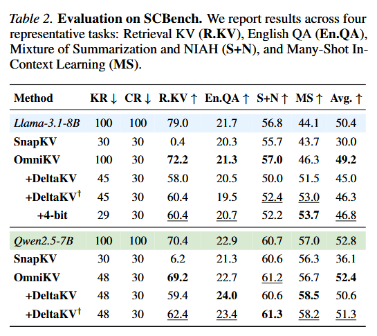

       > *表 2 展示了 SCBench 结果。表格列同样包含 KR、CR，以及四个特定子任务的分数和平均分。SnapKV 在 R.KV 任务上分数暴跌(如 Llama模型上跌至 0.4)，而 DeltaKV 依然能保持较高的分数(如 58.0)。*

    3. **复杂推理AIME任务**

    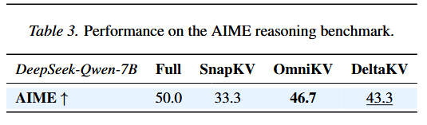

       > *表 3 展示了 DeepSeek-Qwen-7B 模型在 AIME 上的表现。Full(全缓存) 为 50.0，SnapKV 降至 33.3，而 DeltaKV 达到了 43.3，接近 OmniKV 的 46.7。*

*   **推理效率**

    *   在**单张 NVIDIA RTX PRO 6000** (**96GB**，Blackwell架构) 上, 测量了 DeltaKV 嵌入到 Sparse-vLLM 框架中的**解码吞吐量**

        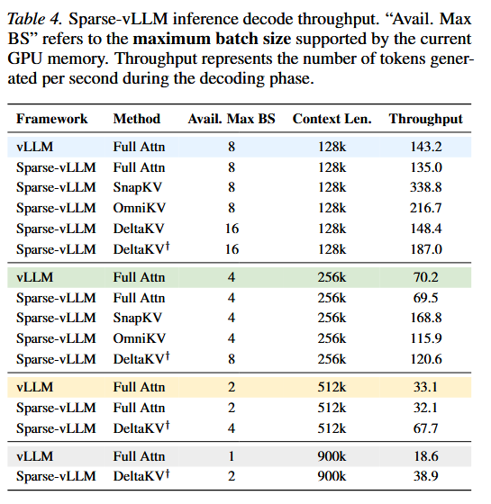

        > 尽管静态驱逐方法（如 SnapKV）可以通过激进地**减少计算量**来实现更高的原始吞吐量，但它们在复杂任务中会产生**显著的精度下降**
        >
        > 对比之下，DeltaKV 则提供了一个更加有利的**效率-精度权衡**

*   **设计分析与消融实验**

    1. **与量化的兼容性 **  

       将 KIVI 提出的逐 Token 量化方法应用到压缩残差 上，可以实现近乎无损的性能.

    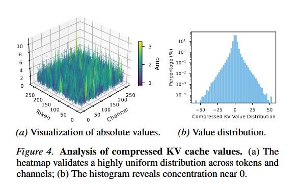

       > **图 4** *分析了压缩后的残差值。图 4a 是一张热力图，横坐标是通道(Channel)，纵坐标是Token，显示了压缩残差在不同通道和 Token 上呈现高度均匀的分布，没有出现极端突刺（Spikes）；图 4b 是一张直方图，横坐标是残差的值，纵坐标是对数频率，显示残差值呈现出以0为中心的钟形分布，绝大部分值极其贴近0。*
       >
       > 数值小 表明了非常适合将 压缩残差 进行量化

    2. **模块消融**

    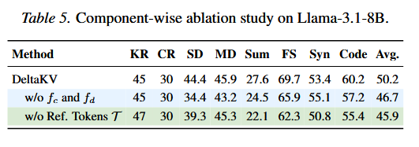

       > 表 5 展示了消融结果。完整 DeltaKV 综合得分为 50.2；移除压缩/解压模块(w/o $f_c$ and $f_d$)后跌至 46.7；移除参考Token(w/o Ref. Tokens $\mathcal{T}$，即不计算残差直接压缩)后跌至 45.9

    3. **超参数敏感性**

       在 128k 序列长度和 Batch Size 为 16 的情况下，评估了不同超参数下的吞吐量表现

    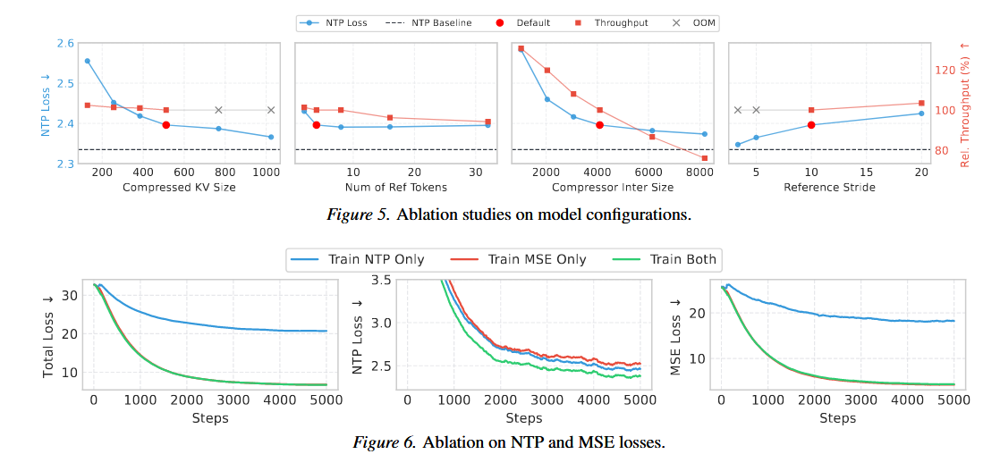

    

*   **结果总结：**

    1.  **极致的内存压缩率：** DeltaKV能将KV Cache内存占用**缩小至原来的29%**。
    2.  **几乎无损的下游任务性能：**
        *   在 LongBench（单轮长文）中，精度媲美保留100%内存的OmniKV，且完美兼容4-bit量化。
        *   在 SCBench（多轮对话）和 AIME（数学推理）中，显著优于SnapKV等静态驱逐方法，证明其能有效保留复杂推理所需的历史信息。
    3.  **显著的推理加速 (系统级表现)：**
        在Sparse-vLLM上运行，DeltaKV引入的额外开销极小。在128k上下文时，吞吐量达到 187.0 tokens/s（原生vLLM为143.2）；在512k极长上下文下，达到 67.7 tokens/s，**吞吐量是原生vLLM（33.1 tokens/s）的2倍**。
    4.  **消融与分布分析：**
        实验证明压缩模块和残差减法缺一不可。且残差化后的KV值高度集中在0附近，天然极其适合低比特量化。

### 4、结论与展望 

*   **文章结论：**
    DeltaKV通过挖掘长距离Token的相似性，成功剥离了KV Cache中冗余的共享结构，只保留轻量级的残差。该设计在保证模型生成精度的同时，大幅缩减了内存开销。协同设计的Sparse-vLLM推理引擎打破了底层框架限制，提供了一条走向可扩展、落地级长上下文LLM部署的实用路径。
*   **未来展望：**
    1.  **全流水线量化 (Full-Pipeline Quantization)：** 目前仅对残差进行了压缩，未来若将全注意力层和参考Token也进行4-bit量化，理论上能将KV内存极限压缩至原大小的 **7.2%**，让消费级显卡跑超长上下文成为可能。
    2.  **算子深度融合 (Operator Fusion)：** 目前重建步骤和注意力计算仍是分开的，未来如果将“解压+重构”直接融合进FlashAttention算子内部，将进一步减少显存读写（HBM traffic），获得更高的加速比。
    3.  **与Offloading机制的完美协同：** 由于DeltaKV大幅降低了Token的“单位体积”，未来结合CPU卸载策略时，可以极大地缓解PCIe带宽瓶颈，实现近乎无限长度的上下文处理。

## 附录：

### 附录 A. DeltaKV 的训练流程
这部分详细解释了 DeltaKV 压缩/解压模块是如何训练出来的（对应论文的 Algorithm 1）。由于模型主体（LLM）的参数是冻结（Frozen）的，训练只需优化极少量的参数（压缩器 $f_c$ 和解压器 $f_d$），流程分为三个核心步骤：

#### 1. 获取真实（Ground Truth）前向传播结果
首先，模型使用**原始且未压缩**的完整 KV Cache 进行一次标准的前向传播。这一步的目的是收集真实、完美的 KV 表征以及最终的输出 Logits，作为后续对照的“标准答案”。

#### 2. DeltaKV 的前向压缩与重构
接下来，算法遍历每一层和每一个 Token 的序列：
*   **检索参考值：** 针对当前的 Token，从固定步幅（stride $s$）的历史参考集 $\mathcal{T}_{ref}$ 中，找出 L2 距离最近的 Top-$k$ 个 Token。
*   **计算残差与压缩：** 计算这 $k$ 个参考 Token 的均值（$KV_R$）。然后将当前 Token 的 $KV$通过压缩器$f_c$降维，并减去压缩后的均值得到残差，得到极小的向量 $z_\Delta$。
*   **重构还原：** 立刻用解压器 $f_d$ 将 $z_\Delta$ 还原回高维，并加上前面的均值 $KV_R$，得到一个**近似重构的 KV 状态（$\widehat{KV}$）**。

#### 3. 端到端双目标损失计算 (End-to-End Loss)
总的损失函数由两部分相加而成：
*   **重构损失 (MSE Loss, $\mathcal{L}_{rec}$)：** 惩罚“近似重构出来的 KV”与第一步“真实的 KV”之间的数值差异（均方误差）。
*   **下一词预测损失 (NTP Loss, $\mathcal{L}_{ntp}$)：** 将重构后的 KV 喂给模型算输出，计算预测下一个 Token 的交叉熵损失。这保证了哪怕数值有细微误差，也不会影响语言模型本身的生成能力。

---

### 附录 B. Sparse-vLLM 的系统实现细节
这一节是整篇论文的系统工程核心。现有的 vLLM 框架很难支持 DeltaKV 这种“坑坑洼洼”（一半是全精度参考 Token，一半是低维残差 Token）的内存结构。作者因此重构了底层，设计了 **Sparse-vLLM**。

#### 1. 缓存管理器 (CacheManager) 的数据结构
为了适应不同算法，CacheManager 被设计成了高度模块化的结构：
*   **逐层独立映射（针对物理驱逐如 SnapKV）：** 为每一层单独维护一张页表，因为 SnapKV 在不同层扔掉的 Token 是不一样的。
*   **全局共享映射（针对逻辑掩码如 OmniKV）：** 全局保留 Token，只在逻辑上打 Mask，所有层共享一张映射表，极大减少元数据（Metadata）开销。
*   **DeltaKV 异构存储（核心）：** 创新性地设计了**双物理池 (Dual Physical Pools)**。一个是 `Full Pool`，用来存高精度的参考 Token 和近期 Token；另一个是 `Latent Pool`，专门存极小的压缩残差。同时实现了**组内槽位共享**，避免在稀疏解码时重复申请显存。

#### 2. 稀疏控制器工作流 (Sparse Controller)
稀疏控制器将算法逻辑和模型架构解耦：
*   **前向计算前（View Construction）：** 在丢入 Attention 算子前，控制器会先查出哪些残差 Token 需要被解压，从 `Latent Pool` 批量抓取并重构成临时的高维 KV。然后利用“虚拟槽位（Slot Virtualization）”技术，将静态的参考 Token 和动态重构的 Token 拼凑成一个逻辑上连续的视图给 GPU 算。
*   **前向计算后（Lifecycle Management）：** 一旦当前的 Token 变老（超出 Recent Buffer），控制器会触发融合算子：计算它与参考值的残差 -> 压缩 -> 写入 `Latent Pool` -> 瞬间释放它原来占用的 `Full Pool` 槽位，以此保证显存不随序列变长而爆炸。

#### 3. 底层 Kernel (算子) 优化
*   **间接寻址：** 修改了 Flash-Decoding 算子，允许 Attention 直接根据映射数组跳跃读取不连续的物理内存，省去了极其耗时的“内存碎片拷贝整理”操作。
*   **深度融合算子：** 写了自定义的 Triton 算子，把“找参考Token、求平均、减法计算”这几步打包成一次 GPU Kernel 启动，把显存读写瓶颈压到了最低。

#### 4. 显存效率的未来潜力 (B.4) 与延迟分析 (B.5)
*   **未来潜力：** 当前只对残差做了量化。如果未来对未压缩的全精度参考 Token 和前面的 Full Attention 层也上 **4-bit 量化**，理论上能把显存压榨到原始大小的 **7.2%**！此外，由于 DeltaKV 把 Token 数据变小了，如果结合 CPU Offloading，PCIe 传输时间将降至 1/16。
*   **延迟分析：** 附录指出，目前的 Python 控制流（如记录页表和生命周期）还存在一些序列化开销（耗时约 91 毫秒）。未来如果把 Python 的控制逻辑全部下放到 C++/CUDA 算子中，还能再获得 1.5倍到 1.7倍 的提速。

---

### 附录 C. OmniKV 原理简介
（在正文中 DeltaKV 的“按需解压”强烈依赖 OmniKV 的筛选机制。此处附录专门为不了解 OmniKV 的读者做了前置科普）：

#### 1. 核心机制：层间相似性与动态选择
OmniKV 将模型挑出少数几层作为“过滤层（Filter layers）”。在过滤层里算完全局 Attention 后，选出得分最高的 Top-$k$ 个重要 Token。后续的“普通层”就不再算全量注意力了，直接照抄过滤层选出的名单，只把这些重要的 Token 送进 Attention 计算。

#### 2. 预填充加速 (Prefill Chunking)
面对几十万字的超长 Prompt，OmniKV 将其切分成小块（Chunks）。每一块处理完后，会算一个**多头最大平均注意力得分**（公式：在当前块内算时间维度的平均分，然后在多头维度取最大值）。通过这个分数，每一块处理完就当场扔掉不重要的历史信息，防止 OOM（内存溢出）。

---

### 附录 D. 详细的实验配置

#### 1. 基准测试与任务选择 (D.1)
*   **LongBench：** 包含 16 个数据集，覆盖单/多文档 QA、摘要、代码等（主要测单轮长文）。
*   **SCBench：** 选了 4 个代表性任务（主要测多轮对话，由于复杂所以更难）。
*   **AIME：** 极其复杂的数学推理任务测试。

#### 2. 指标定义 (D.2) 与 模型设定 (D.3)
*   **KR (KV Cache Keep Ratio)：** 保留在 GPU 显存中的 KV 占原本总大小的百分比（反映显存省了多少）。
*   **CR (KV Cache Compute Ratio)：** 实际参与 Attention 矩阵乘法的 Token 比例（反映算力省了多少）。
*   模型使用了开源生态最火的：Llama-3.1-8B-Instruct、Qwen2.5 (7B/32B)、以及 DeepSeek-R1-Distill-Qwen-7B（详见 Table 6）。

#### 3. DeltaKV 的详细超参数设定 (D.4 & Table 7)
*   **训练环境：** 单卡 RTX PRO 6000，使用 AdamW 优化器，在 Fineweb-Edu 语料上仅训了 8 小时。
*   **压缩率：** 压缩维度 $d_c$ 设置为原始 KV 维度的 **25%**。
*   **参考设定：** 每隔 $s=10$ 个步幅留一个全精度参考 Token，检索最相似的 $k=4$ 个进行均值计算。
*   **混合层策略 (Table 7)：** 根据重要性分析，手动挑选了极少数的几层保留 100% 全注意力（比如 Llama-8B 挑选了第 0, 1, 2, 8, 18 层），剩下的所有层全部上 DeltaKV 压缩。

#### 4. KR 与 CR 的数学计算公式 (D.5)
这一节极其严谨地给出了**为何 DeltaKV 能把显存压到 29% 左右**的计算公式：
*   **静态驱逐（SnapKV）：** 删了 70%，KR 就是 30%，CR 也是 30%。
*   **动态选择（OmniKV）：** 显存必须留全量（KR=100%），算力只挑 30%（CR=30%）。
*   **DeltaKV：** 它的 KR 计算公式为：$$KR = \frac{L_{full}}{L_{total}} + \frac{L_{sparse}}{L_{total}} \times \left( \frac{1}{s} + \frac{d_c}{2d_k} \right)$$
    *白话解释：全注意力层的保留率是100%；稀疏层的保留率 = 参考Token的占比 (1/10) + 压缩残差的维度占比 (0.25) = 0.35。结合层数加权平均后，最终的 KR 落在 43%~45% 左右（如果进一步对残差进行 INT4 量化，则进一步暴降到 29%）。*

---

### 附录 E. 详细的补充实验结果
正文由于篇幅限制只放了总分，这部分附上了最详尽的各数据集切片跑分（表格 9 到 14）：

#### 1. LongBench 详细明细 (E.1)
*   **Table 9 & 10：** 展示了 Llama-8B 和 Qwen-7B/32B 在单文档、多文档、摘要、代码、合成任务上的**逐项得分**。可以看到 DeltaKV 在绝大多数单项上都紧咬 Full Cache（全量缓存）的成绩，远超 SnapKV。
*   **Table 11 & 12 (模块消融)：** 详细展示了“如果不使用残差相减”或“如果不使用压缩网络”，在各个具体的 QA 或摘要任务上，模型分数会发生怎样严重的崩溃。

#### 2. SCBench 详细明细 (E.2)
*   **Table 13 & 14：** 展示了在极其刁钻的多轮对话测试（如：多段信息检索、多轮混合摘要）中的表现。在检索任务（R-1 到 R-5）中，**静态驱逐方法（如 SnapKV）出现了近乎 0 分的惨状**（因为它把中间的关键检索词永久删掉了），而 DeltaKV 依然能保持 50~60 的高分，证明了其压缩算法对关键信息的无损保留能力。